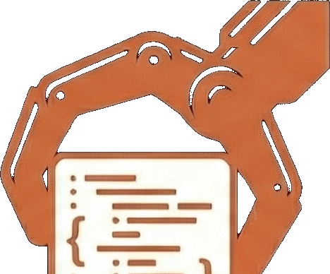

<p align="center">
  
</p>

# Claw - The Claude Code Wrapper

Desktop UI for Claude Code with local agent execution using AWS SSO and Bedrock

## Features

### Run Claude agents the right way

Run agents locally, in worktrees, in background — without touching main branch.

- **Git Worktree Isolation** - Each chat session runs in its own isolated worktree
- **Background Execution** - Run agents in background while you continue working
- **Local-first** - All code stays on your machine, no cloud sync required
- **Branch Safety** - Never accidentally commit to main branch

---

### UI that finally respects your code

Cursor-like UI for Claude Code with diff previews, built-in git client, and the ability to see changes before they land.

- **Diff Previews** - See exactly what changes Claude is making in real-time
- **Built-in Git Client** - Stage, commit, and manage branches without leaving the app
- **Change Tracking** - Visual diffs and PR management
- **Real-time Tool Execution** - See bash commands, file edits, and web searches as they happen

---

### Plan mode that actually helps you think

Claude asks clarifying questions, builds structured plans, and shows clean markdown preview — all before execution.


- **Clarifying Questions** - Claude asks what it needs to know before starting
- **Structured Plans** - See step-by-step breakdown of what will happen
- **Clean Markdown Preview** - Review plans in readable format
- **Review Before Execution** - Approve or modify the plan before Claude acts

---

### More Features

- **Plan & Agent Modes** - Read-only analysis or full code execution permissions
- **Project Management** - Link local folders with automatic Git remote detection
- **Integrated Terminal** - Full terminal access within the app

## Installation

### Homebrew (macOS - Recommended)

```bash
brew install your-org/claw/claw
```

After installation, Claw will auto-update itself.

### Direct Download

Download the latest release from the [GitHub releases page](https://github.com/your-org/claw/releases).

### Build from source

**Prerequisites:**
- **Flox** - For reproducible development environment ([install instructions](https://flox.dev/docs))
- **Python 3** - For native module compilation
- **Xcode Command Line Tools** (macOS) - Run `xcode-select --install`

**Build steps:**

```bash
# 1. Activate Flox environment (manages bun, electron)
cd /path/to/claw
flox activate

# 2. Install JavaScript dependencies
bun install

# 3. Download Claude binary (required for agent functionality)
bun run claude:download

# 4. Build and package
bun run build
bun run package:mac  # or package:win, package:linux
```

> **Important:** The Flox environment provides bun and electron. The `claude:download` step downloads the Claude CLI binary which is required for agent chat functionality.

## Development

```bash
# First time setup
flox activate
bun install
bun run claude:download  # First time only

# Daily workflow
flox activate  # Once per terminal session
bun run dev
```


## License

Apache License 2.0 - see [LICENSE](LICENSE) for details.
