<p align="center">
  
</p>

# Claw

> Desktop UI for Claude Code with local agent execution, Kubernetes management, and 16+ MCP server integrations

Claw is an Electron desktop app that wraps the Claude Code SDK, providing a local-first interface for AI-powered development. Run agents in isolated Git worktrees, manage Kubernetes clusters, integrate with MCP servers, and execute code locally without cloud sync.

## Features

### 🤖 Claude Agent Execution

**4 Authentication Methods:**
- **Claude Pro/Max** - Use your Claude subscription (recommended)
- **Anthropic API Key** - Pay-as-you-go with direct API key
- **Custom Model** - Configure custom base URL and model name
- **AWS Bedrock SSO** - Use Claude via Amazon Bedrock with device authorization flow

**Agent Capabilities:**
- **Plan Mode** - Read-only analysis with clarifying questions before execution
- **Agent Mode** - Full code execution with tool permissions
- **Background Agents** - Run long-running tasks in background using Haiku
- **Session Resume** - Continue interrupted sessions from where they left off
- **Sub-chat System** - Multiple parallel conversation tabs per chat
- **Model Selection** - Choose between Opus, Sonnet (default), or Haiku
- **Cross-View Chat Persistence** - Chat sessions persist across sidebar tabs and views

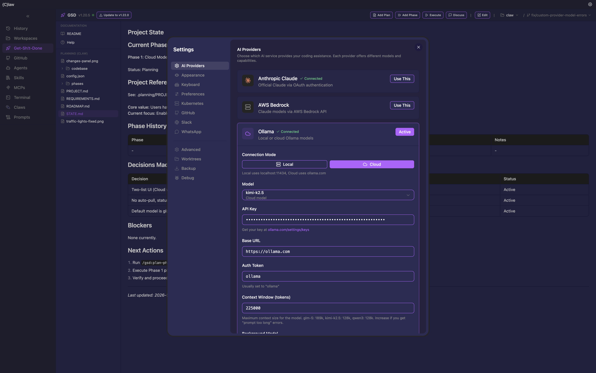
*AI provider selection: Anthropic Claude (OAuth), AWS Bedrock, and Ollama with per-provider model and context window configuration*

### 🌿 Git Worktree Isolation

Each chat runs in its own Git worktree with an isolated branch:
- Auto-generated branch names (adjective-animal-hash pattern)
- Custom worktree location configuration
- Never touch main branch during agent execution
- Merge branches back when ready with merge dialog
- Git LFS support detection
- Base branch auto-detection (main/master/develop/trunk)

### 🔍 Visual Diff & Change Management

Built-in Git client with comprehensive change tracking:
- Real-time diff previews (split/unified view modes)
- File staging and commit interface
- PR URL and PR number tracking per chat
- Merge branch dialog for worktree integration
- History view for commits
- Change categorization and filtering


### ☸️ Kubernetes Management

Multi-cluster EKS integration with real-time monitoring:
- **Dashboard** - Node metrics, pod status, resource usage charts
- **Pod Management** - List, inspect, and monitor pods
- **Service Management** - View and manage Kubernetes services
- **Deployment Views** - Track deployment status
- **Live Log Streaming** - Real-time logs with auto-scroll, word wrap, service filtering
- **DevSpace Integration** - Development environment management

*Real-time Kubernetes log streaming with service filtering*

### 🐙 GitHub Integration

Deep GitHub integration for code review and project management:
- **PR Review** - Browse open pull requests with full diff view
- **Issue Tracking** - View and chat about issues with agent context
- **Code Browser** - Navigate repository file tree and view file contents
- **Architecture Analysis** - Generate Mermaid diagrams from code structure
- **Agent Chat** - Chat with Claude agents about any PR, issue, or file in context
- **README View** - Auto-displays repository README when expanding a repo

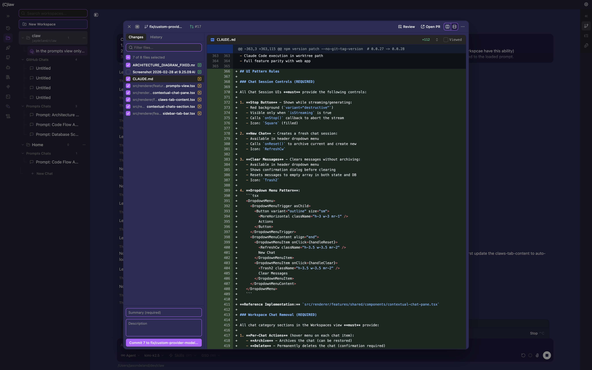
*GitHub PR diff view with full file change context and agent chat panel*

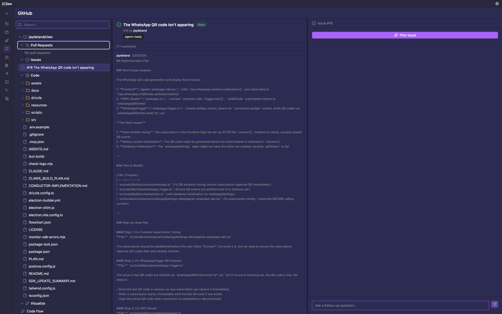
*Agent analyzing a GitHub issue with access to the full repository context*

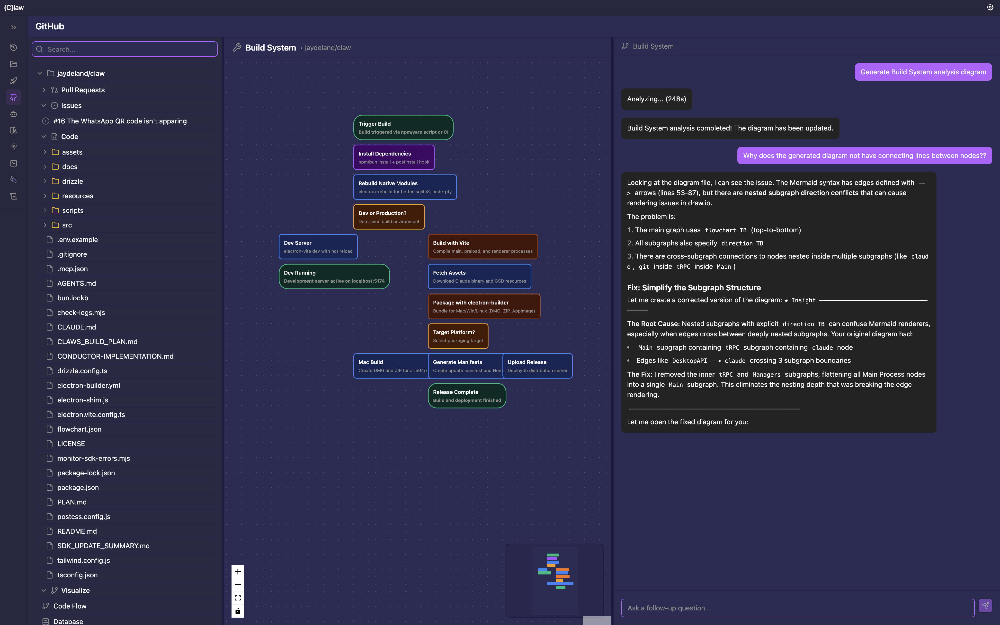
*AI-generated architecture diagram from repository analysis with chat interface*

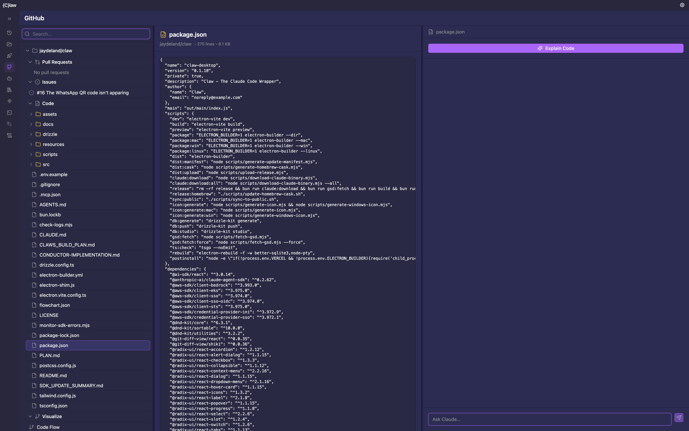
*Repository file tree with inline code viewer*

### 📋 GSD (Get Shit Done) Workflow

Structured planning system with execution tracking:
- Phase-based project planning
- Planning document editor with markdown preview
- Execution tracking and status
- Branch-specific planning
- Commands: `/gsd:plan-phase`, `/gsd:add-phase`, `/gsd:execute-phase`, `/gsd:discuss-phase`, `/gsd:map-codebase`
- Version management and auto-update

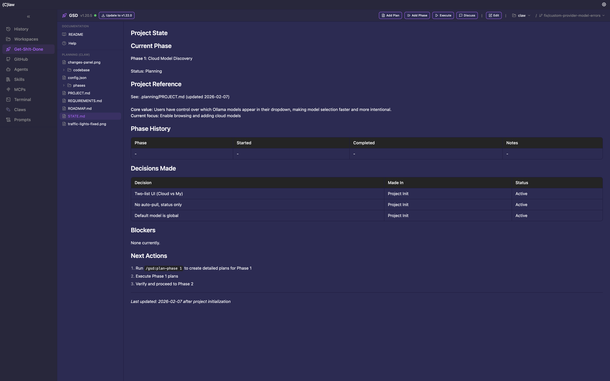
*GSD project state view showing current phase, decisions, and next actions*

### 🔌 MCP Server Integration

Comprehensive MCP (Model Context Protocol) server support:
- **16+ Supported Servers** - GitHub, AWS (EKS, ECS, Diagram, Documentation, Terraform, API), Datadog, Atlassian, Context7, Chrome DevTools, Figma, Rollbar, Electron, Filesystem, Server-Time
- **OAuth 2.1 Authentication** - Full PKCE flow with credential encryption
- **Credential Management** - Encrypted storage using Electron safeStorage
- **Tool Caching** - Performance optimization for frequently used tools
- **Status Monitoring** - Real-time connection status (connected, needs-auth, failed)
- **Enable/Disable** - Toggle servers per project

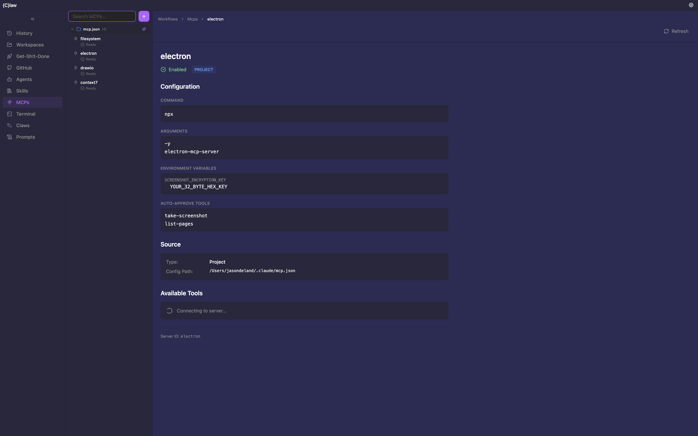
*Per-server configuration: command, arguments, environment variables, auto-approve tools, and connection status*

### 💻 Integrated Terminal

Full xterm.js terminal emulator with advanced features:
- Multiple terminal tabs
- Search (Cmd+F) with history
- Word wrap toggle
- VS Code theme integration
- Drag-and-drop file paths
- Session serialization and restore
- OSC-7 current directory parsing

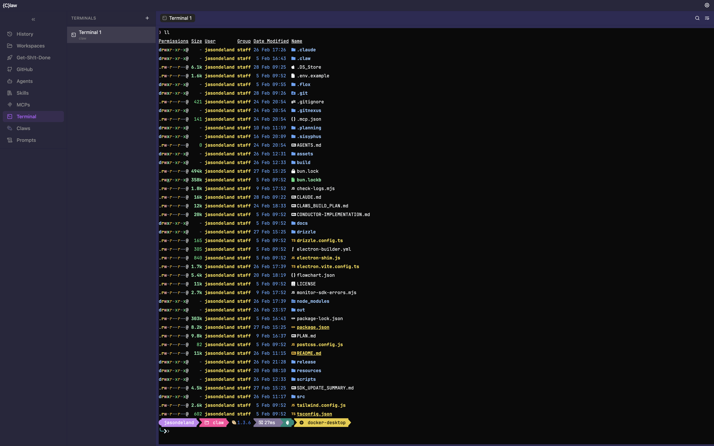
*Terminal with colorized file listing showing project directory structure*

### 📑 11 Sidebar Tabs

Complete workspace navigation:
1. **History** - Chat archive and search
2. **Workspaces** - Projects and chats
3. **Clusters** - Kubernetes clusters
4. **GSD** - Project planning
5. **GitHub** - GitHub integration and PR management
6. **Agents** - Agent management
7. **Skills** - Skills library
8. **MCPs** - MCP server list
9. **Terminal** - Terminal sessions
10. **Claws** - Messaging integrations (Slack, WhatsApp)
11. **Prompts** - Saved prompts library

### 📊 Session Flow Visualization

Visual conversation flow using ReactFlow:
- See user messages, assistant responses, and tool calls as connected nodes
- Track thinking blocks, background tasks, and agent spawns
- Understand conversation structure at a glance
- Live updates as conversation progresses
- Zoom, pan, and fit-to-view controls

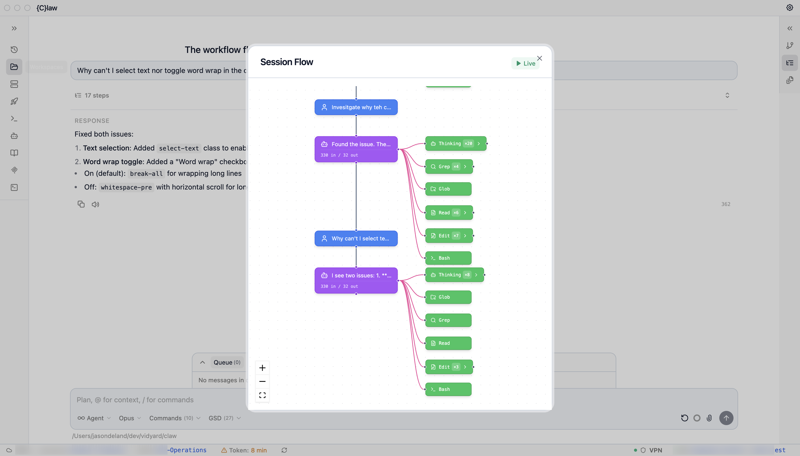
*Visual session flow showing conversation structure and tool execution*

### 🔀 Workflows

Visual workflow system for complex automations:
- Flowchart view showing MCP server connections, tools, and agents
- Markdown documentation view
- Review mode with Claude integration
- Build multi-step workflows connecting MCP tools and agents
- Visual debugging of workflow execution paths

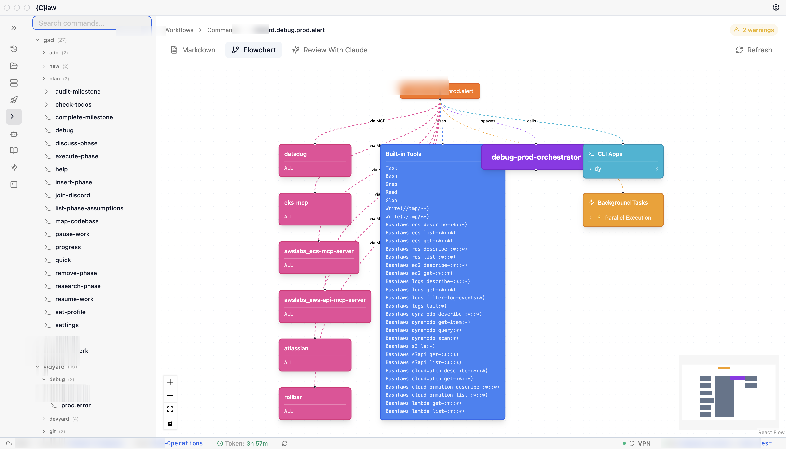
*Workflow flowchart showing MCP integrations and tool execution paths*

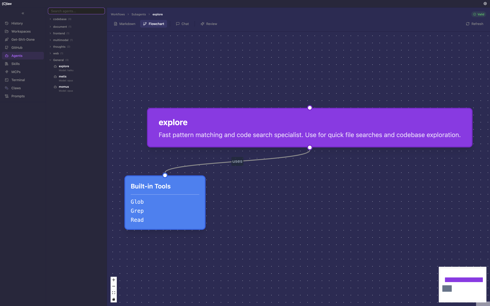
*Subagent flowchart view showing tools available to each agent*

### 🦞 Claws (Messaging Integrations)

Connect external messaging platforms to Claw agents:
- **Slack Integration** - Socket Mode connection for real-time messaging
- **WhatsApp Integration** - QR code pairing via Baileys library
- **Agent Routing** - Route messages to specific Claw agents
- **Trigger Configuration** - Set up message triggers and auto-responses
- **Channel Management** - Connect multiple channels per integration

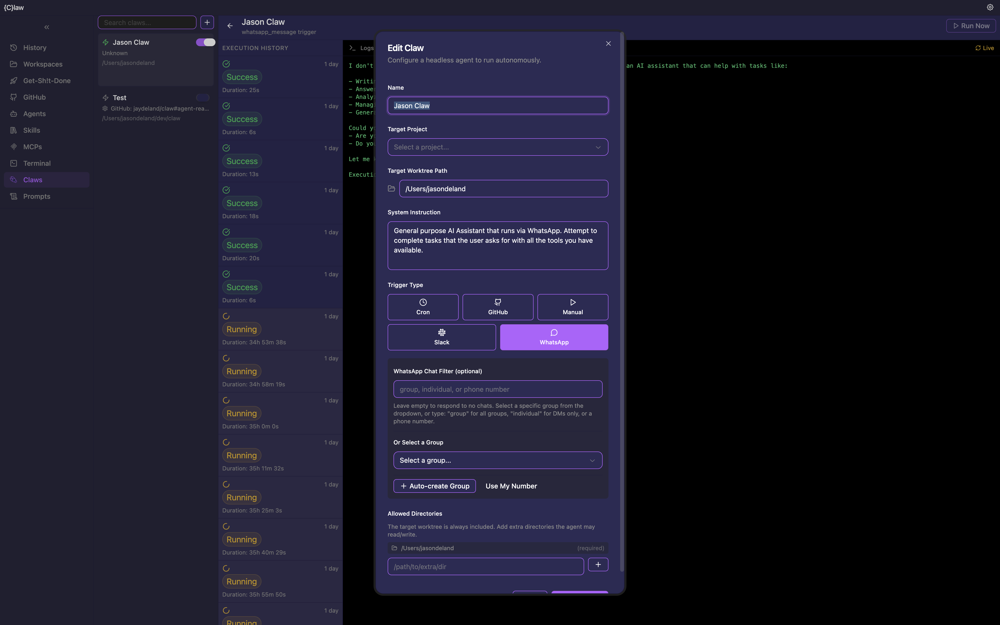
*Headless agent configuration with trigger type (Cron, GitHub, Slack, WhatsApp), system instruction, and execution history*

### 📝 Prompts Library

Manage and use saved system prompts across agent sessions:
- **Categorized Library** - Organize prompts by type (MCP, Chat, Background, Analysis)
- **Live Editor** - Edit prompt content with character count and instant preview
- **Agent Integration** - Use prompts as system context in any agent chat
- **11+ Built-in Prompts** - Chat title generation, code analysis, architecture review, and more

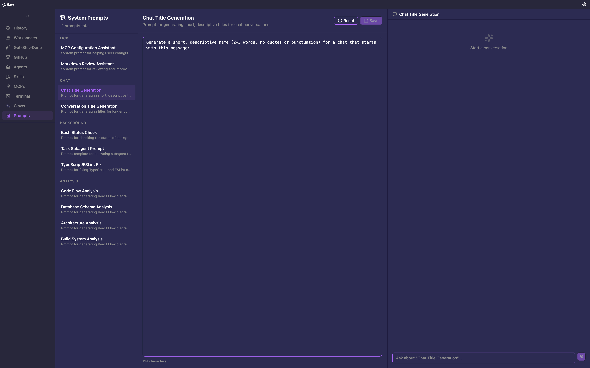
*Prompts library with categorized system prompts and live editor*

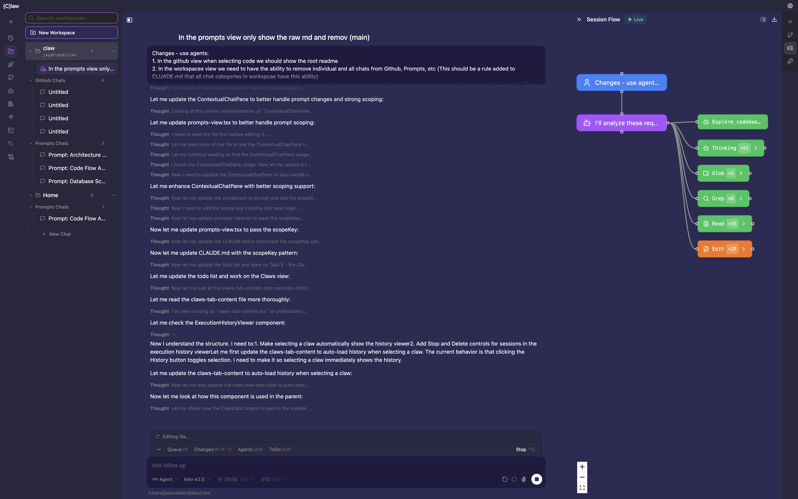
*Agent chat initiated from Prompts view with full tool execution tree*

### 📊 Additional Features

- **Settings** - 15+ configuration tabs (appearance, keyboard, MCP, models, Kubernetes, beta features, etc.)
- **File Attachments** - Image uploads and file mentions in chat
- **Desktop Notifications** - System notifications for task completion
- **Update Checker** - Automatic update notifications
- **VPN Connectivity Check** - Optional internal URL monitoring for corporate environments

## Installation

### macOS

Download the latest release from [GitHub Releases](https://github.com/jaydeland/claw/releases):

- **Apple Silicon (M1/M2/M3):** `Claw-[version]-arm64-mac.zip`
- **Intel:** `Claw-[version]-mac.zip`

Extract the ZIP and drag Claw.app to your Applications folder.

### Build from Source

**Prerequisites:**
- [Flox](https://flox.dev/docs) - Development environment manager
- Python 3 - For native module compilation
- Xcode Command Line Tools (macOS) - `xcode-select --install`

**Steps:**

```bash
# 1. Clone repository
git clone https://github.com/jaydeland/claw.git
cd claw

# 2. Activate Flox environment (provides bun and electron)
flox activate

# 3. Install JavaScript dependencies
bun install

# 4. Download Claude Code binary (required for agent functionality)
bun run claude:download

# 5. Build and package
bun run build
bun run package:mac  # or package:win, package:linux
```

Built packages will be in the `release/` directory.

## Development

```bash
# Daily workflow
flox activate          # Once per terminal session (provides bun, electron)
bun run dev            # Start with hot reload

# Database operations
bun run db:generate    # Generate migrations from schema changes
bun run db:push        # Push schema directly (dev only, no migrations)
bun run db:studio      # Open Drizzle Studio database browser

# Icon generation
bun run icon:generate      # Regenerate all platform icons
bun run icon:generate:mac  # macOS only (ICNS)
bun run icon:generate:win  # Windows only (ICO)
```

## Architecture

**Tech Stack:**
- **Desktop:** Electron 33.4.5, electron-vite, electron-builder
- **UI:** React 19, TypeScript 5.4.5, Tailwind CSS 3.4, Radix UI, Motion 11
- **State Management:** Jotai (UI state), Zustand (persistence), React Query (server state)
- **Backend IPC:** tRPC 11 with trpc-electron for type-safe communication
- **Database:** Drizzle ORM 0.45 + better-sqlite3 11.8
- **AI SDK:** @anthropic-ai/claude-code 0.2.12
- **Terminal:** xterm.js 5.3 with canvas, fit, search, weblinks addons
- **Git:** simple-git 3.28, native git commands
- **Kubernetes:** kubernetesjs 0.7.6, AWS SDK for EKS
- **MCP:** Native MCP client with OAuth 2.1 support

**Database:**
- **Location:** `{userData}/data/agents.db` (SQLite with WAL mode)
- **Auto-migrations:** Runs on app startup from `drizzle/` folder (dev) or `resources/migrations` (packaged)
- **Main Tables:**
  - `projects` - Local project folders with Git remote info
  - `chats` - Chat sessions with worktree paths and PR tracking
  - `sub_chats` - Sub-chat tabs with messages and session IDs
  - `claude_code_settings` - App configuration including AWS SSO credentials
  - `background_tasks` - Background agent task tracking
  - `conductor_jobs` - Kanban task data
  - `mcp_credentials` - Encrypted MCP OAuth tokens with expiration

**Authentication Storage:**
- **Billing method:** localStorage (`onboarding:billing-method`)
- **AWS credentials:** Encrypted in database using Electron safeStorage
- **MCP OAuth tokens:** Encrypted in database with automatic refresh

## Troubleshooting

### Architecture Mismatch (better-sqlite3)

If you see `mach-o file, but is an incompatible architecture` errors after pulling code:

```bash
# Clean reinstall for correct architecture
rm -rf node_modules/better-sqlite3
bun install
# The postinstall script automatically runs electron-rebuild
```

This occurs when switching between Intel and Apple Silicon machines.

### Database Migration Issues

If the app fails to start with database errors:

```bash
# Check database location
ls -la ~/Library/Application\ Support/Claw/data/agents.db

# Backup and reset (WARNING: deletes all local data)
rm -rf ~/Library/Application\ Support/Claw/
```

The app will recreate the database with all migrations on next launch.

### Remote Debugging (for MCP development)

The app enables remote debugging on port **9223** in development mode:

```bash
# Test debugger endpoint
curl http://localhost:9223/json

# Configure electron-mcp-server in Claude Desktop
# Add to ~/.claude/mcp.json (server auto-scans ports 9222-9225)
```

## License

Apache License 2.0 - see [LICENSE](LICENSE) for details.

---

**Built with Claude Code** 🤖
